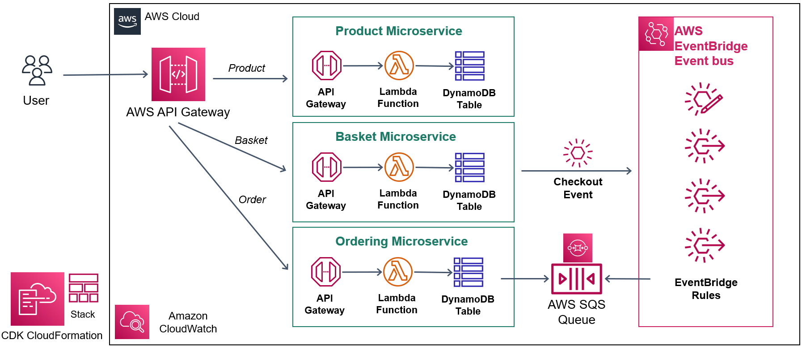

# Serverless Event-driven E-commerce Microservices 🛒🚀


This is a Serverless Event-driven E-commerce project for TypeScript development with CDK.

## 📝 Quick Links

- [What's Included In This Repository](#whats-included-in-this-repository)
- [Project Architecture](#project-architecture)
- [Microservices Overview](#microservices-overview)
- [Prerequisites](#prerequisites)
- [Run The Project](#run-the-project)
- [Useful Commands](#useful-commands)
- [Troubleshooting](#troubleshooting)
- [Author](#author)

## 📦 What's Included In This Repository <a id='whats-included-in-this-repository'></a>

This repository follows the reference architecture above, implementing a real-world **Serverless E-commerce application** with:

- 🌐 **REST API** and **CRUD** endpoints using **AWS Lambda, API Gateway**
- 📊 **Data persistence** using **AWS DynamoDB**
- 🔁 **Decoupled microservices** with events through **Amazon EventBridge**
- 📬 **Message Queues** for cross-service communication using **AWS SQS**
- 🏗️ **Cloud stack development** with **IaC** via **AWS CloudFormation and AWS CDK**

## 🏛️ Project Architecture <a id='project-architecture'></a>

This project follows a serverless, event-driven architecture. Here’s a breakdown of the components:

- **API Gateway**: Exposes RESTful endpoints for users to interact with.
- **AWS Lambda**: Executes business logic for each microservice.
- **DynamoDB**: Stores product, basket, and order information in a scalable way.
- **EventBridge**: Manages event routing between microservices to ensure loose coupling.
- **SQS**: Acts as a message buffer to handle high-throughput, cross-service communication.

## 📌 Microservices Overview <a id='microservices-overview'></a>

- **Products Service**: Manages product listings, including adding, updating, and retrieving products.
- **Baskets Service**: Handles user baskets, allowing items to be added or removed.
- **Orders Service**: Manages order creation and tracking, consuming events from other services.

## 🛠 Prerequisites <a id='prerequisites'></a>

You will need the following tools:

- 🪪 AWS Account and User
- 🖥️ AWS CLI
- 📦 NodeJS
- 🛠️ AWS CDK Toolkit
- 🐳 Docker

### 🚀 Run The Project <a id='run-the-project'></a>

Follow these steps to get your development environment set up:

1. Set up the AWS CLI by running the following command:

```bash
aws configure
```

2. Clone the repository

3. In the root directory containing the **cdk.json** file, run the following command:

```bash
cdk deploy
```

> ⚠️ **Note**: Make sure that Docker is running before executing the `cdk deploy` command.

4. Wait for all microservices to be provisioned into AWS cloud. That’s it! 🎉

5. You can **launch microservices** using the URLs below:

- **Products API** -> `https://xxx.execute-api.ap-southeast-1.amazonaws.com/{stage}/products`
- **Baskets API** -> `https://xxx.execute-api.ap-southeast-1.amazonaws.com/{stage}/baskets`
- **Orders API** -> `https://xxx.execute-api.ap-southeast-1.amazonaws.com/{stage}/orders`

6. Copy the Postman collection from the **/postman** folder for testing.

## 📋 Useful Commands <a id='useful-commands'></a>

- `npm run build` - Compile TypeScript to JavaScript
- `npm run watch` - Watch for changes and recompile
- `cdk synth` - Emit the synthesized CloudFormation template
- `cdk diff` - Compare deployed stack with current state
- `cdk deploy` - Deploy this stack to your default AWS account/region
- `cdk destroy` - Delete the deployed stack from your AWS account
- `cdk bootstrap` - Prepare your AWS environment for deployment with CDK (required for first-time setup)

## 🛠️ Troubleshooting <a id='troubleshooting'></a>

- **Permissions Errors**: Make sure your AWS user has sufficient permissions for Lambda, API Gateway, EventBridge, and DynamoDB.
- **Docker Not Running**: Ensure Docker is running before deploying, as some Lambda dependencies might need Docker.
- **CDK Bootstrap Error**: If CDK commands fail, try running `cdk bootstrap` to set up the environment.

## 👤 Author <a id='author'></a>

- **Grisha Hovhanyan** - [github:grishahovhanyan](https://github.com/grishahovhanyan)

> 📚 [Udemy Course](https://www.udemy.com/course/aws-serverless-microservices-lambda-eventbridge-sqs-apigateway/?couponCode=KEEPLEARNING)
